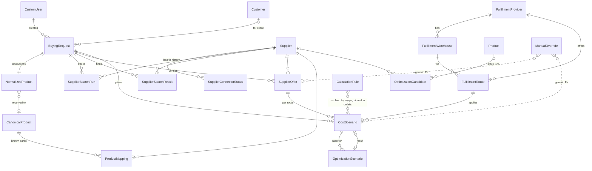
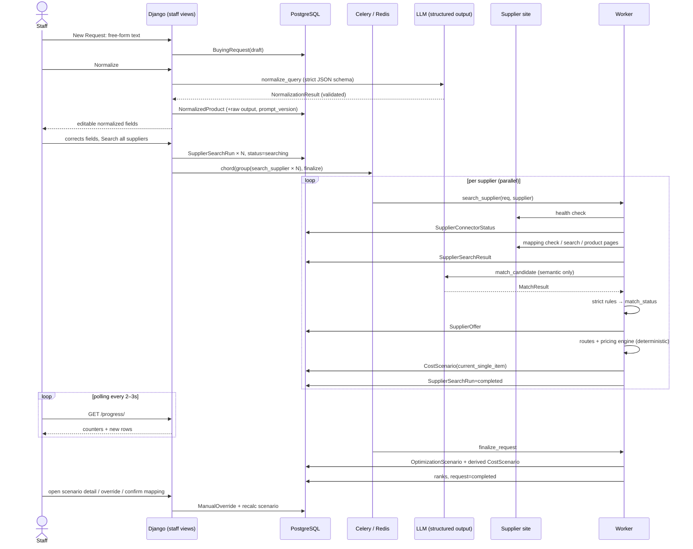

# Buying — Architecture Design Document

Статус: **согласован** — комментарии владельца от 2026-08-06 внесены (Canonical Product, AIProvider-абстракция, Search Cache, разделение raw-ответов, направления развития — см. §14).
Дата: 2026-08-06.
Область: внутренний staff-модуль Buying — полный процесс «как оптимально купить конкретный товар для клиента, привезти его в Грузию и рассчитать конечную цену».

---

## 1. Текущая архитектура проекта (результат анализа)

| Компонент | Факт | Где |
|---|---|---|
| Framework | Django 5.0.1, единый `settings.py` | `tenrivals/tenrivals/settings.py` |
| База данных | PostgreSQL (`psycopg2`, `dj-database-url`), JSONField активно используется | `settings.py:129–153` |
| Очередь | Celery 5.4 + Redis (broker и result backend), django-celery-beat (DatabaseScheduler) | `tenrivals/tenrivals/celery.py`, Procfile (`worker`, `beat`) |
| Деплой | Heroku: gunicorn, S3 media, whitenoise, `release: migrate` | `Procfile` |
| Staff-раздел | Кастомная панель под `/administration/`, namespace `administration`. URL-карта в `persons/administration_urls.py`, views в `persons/views.py`, `shop/staff_sales_views.py`, `shop/staff_analytics.py` | `tenrivals/urls.py:57` |
| Доступ в staff | `@login_required` + `@user_passes_test(is_superuser)`. Django permissions/groups в staff-панели **не используются** | `persons/views.py:703` |
| Навигация staff | Жёстко в шаблоне `templates/persons/staff_nav.html`, активный пункт через context `staff_nav_active` | — |
| Frontend staff | Server-rendered FBV, `staff_base.html` (Saira, inline CSS), vanilla JS, без HTMX/Channels/websockets. Прогресс/поллинг нигде не реализован | `templates/persons/staff_base.html` |
| ORM-паттерны | `DecimalField(10,2)`, базовая валюта GEL; JSON size→qty maps (`shop/size_inventory.py`); MTI продуктов (`Racket`/`Shoe`/… ⊂ `Product`) | `shop/models.py` |
| FX | Только ручной `exchange_rate` на staff-инвойсах (`sales_order_currency.py`). Автозагрузки курсов нет | — |
| AI/LLM | **Отсутствуют полностью**: нет SDK, ключей, обёрток | — |
| Scraping | Прецедент: `requests` + BeautifulSoup в management-командах (импорт с Tennis Warehouse Europe). Playwright/selenium нет. `httpx` в requirements, но не используется | `shop/management/commands/import_shop_product.py` |
| Закупки/поставщики | Моделей `Supplier`/`PurchaseOrder` **нет**. Смежное: `StockReceipt` (приём партий, weighted-avg `landed_cost_gel`), `ProductListing` (STOCK/PREORDER), `OrderForMe` (клиентские ссылки) | `shop/models.py`, `shop/stock_receipts.py` |
| Аудит | Универсального audit log нет; частичные журналы (`StockReceipt.created_by`, `PromoRedemption`) | — |
| Логирование | LOGGING dict (console + file), Sentry SDK подключён | `settings.py:386–454` |
| Тесты | `django.test.TestCase`, ~23 теста, fixtures JSON | `shop/tests.py` |
| Service layer | shop: доменные модули (`stock_receipts.py`, `sales_order_stock.py`, …); rivals: `services.py` | — |
| `dashboard` app | Мёртвая заготовка, не в `INSTALLED_APPS` — **не использовать** | `tenrivals/dashboard/` |

### Выводы

1. Не нужен параллельный framework: Celery/Redis, PostgreSQL, staff-shell и шаблонные паттерны уже есть и подходят.
2. Buying — новое Django-приложение `buying` рядом с `shop`/`persons`/`rivals` (не `dashboard`).
3. AI-слой и слой коннекторов строятся с нуля внутри `buying`.
4. Параллелизм — через Celery «задача на магазин», а не asyncio: в проекте нет async-инфраструктуры, а Celery даёт изоляцию, ретраи и трекинг per-supplier бесплатно.
5. Live-обновление таблицы результатов — polling лёгкого JSON-endpoint (vanilla JS `fetch`), без Channels.

---

## 2. Предлагаемая структура Buying

### 2.1 Код

```text
tenrivals/buying/
    __init__.py
    apps.py
    admin.py
    models/
        __init__.py          # re-export всех моделей
        requests.py          # BuyingRequest, NormalizedProduct
        canonical.py         # CanonicalProduct — база знаний товаров (не каталог)
        suppliers.py         # Supplier, SupplierConnectorStatus, SupplierSearchRun,
                             # SupplierSearchResult, SupplierOffer, ProductMapping
        fulfillment.py       # FulfillmentProvider, FulfillmentWarehouse, FulfillmentRoute
        pricing.py           # CalculationRule, CostScenario
        optimization.py      # OptimizationScenario, OptimizationCandidate
        audit.py             # ManualOverride
        permissions.py       # BuyingPermissions (managed=False, только Meta.permissions)
    connectors/
        base.py              # SupplierConnector, dataclasses, исключения
        registry.py          # реестр connector_code -> class
        http.py              # общий httpx-клиент: UA, таймауты, retries, троттлинг
        tennis_warehouse_eu.py, tennis_point.py, ...   # по согласованному списку
    ai/
        base.py              # AIProvider (абстракция): normalize() / match() / generate_search_queries()
        registry.py          # выбор реализации по settings.BUYING_AI_PROVIDER
        providers/openai_provider.py   # текущая реализация (structured output через HTTP API)
        schemas.py           # strict JSON schemas + валидация NormalizationResult, MatchResult
        prompts.py           # versioned prompt templates (PROMPT_VERSION)
    engine/
        rules.py             # resolve_rules(): выбор CalculationRule по scope/priority
        weight.py            # Weight Engine
        fx.py                # курсы валют (NBG API + manual override)
        pricing.py           # build_cost_scenario(): чистые функции расчёта
        routes.py            # Fulfillment Engine: подбор маршрутов для оффера
        optimization.py      # Optimization Engine
        ranking.py           # ранжирование Cost Scenarios
        allocation.py        # распределение общих расходов между товарами
    services/
        requests.py          # lifecycle BuyingRequest (create, re-run, duplicate, archive)
        search.py            # оркестрация поиска, mapping-first логика
        overrides.py         # применение manual override + аудит
    tasks.py                 # Celery-задачи
    forms.py
    staff_urls.py            # подключается в persons/administration_urls.py
    staff_views.py
    migrations/
    tests/
        fixtures/<supplier_code>/   # обезличенные HTML/JSON fixtures
        test_normalization.py, test_matching.py, test_pricing.py,
        test_weight.py, test_optimization.py, test_connectors.py,
        test_lifecycle.py, test_views.py

tenrivals/templates/buying/staff/
    requests_list.html, request_new.html, request_detail.html,
    scenario_detail.html, suppliers.html, connector_status.html,
    mappings.html, routes.html, rules.html, optimization_rules.html
```

### 2.2 URL и навигация

Монтирование внутрь существующего staff-shell:

```python
# persons/administration_urls.py
path('buying/', include('buying.staff_urls')),
```

| Пункт меню | URL | name |
|---|---|---|
| Buying Requests | `/administration/buying/` | `administration:buying_requests` |
| New Request | `/administration/buying/new/` | `administration:buying_request_new` |
| Request detail | `/administration/buying/<id>/` | `administration:buying_request_detail` |
| Progress JSON (polling) | `/administration/buying/<id>/progress/` | `administration:buying_request_progress` |
| Cost Scenario detail | `/administration/buying/scenarios/<id>/` | `administration:buying_scenario_detail` |
| Suppliers | `/administration/buying/suppliers/` | `administration:buying_suppliers` |
| Connector Status | `/administration/buying/connectors/` | `administration:buying_connectors` |
| Product Mappings | `/administration/buying/mappings/` | `administration:buying_mappings` |
| Fulfillment Routes | `/administration/buying/routes/` | `administration:buying_routes` |
| Pricing Rules | `/administration/buying/pricing-rules/` | `administration:buying_pricing_rules` |
| Optimization Rules | `/administration/buying/optimization-rules/` | `administration:buying_optimization_rules` |

В `staff_nav.html` добавляется новая группа **Buying** между Sales и Marketing. UI на английском, шаблоны наследуют `persons/staff_base.html`. Типографика: заголовки Saira 800 — только UPPERCASE (проектное правило); обычный текст — Saira 400/600.

### 2.3 Permissions

Задача требует гранулярные permissions; текущий staff — только `is_superuser`. Решение — стандартный Django permissions framework (уже в проекте через `django.contrib.auth`), без новой системы:

```python
# buying/models/permissions.py
class BuyingPermissions(models.Model):
    class Meta:
        managed = False          # без таблицы, только контейнер permissions
        default_permissions = ()
        permissions = [
            ('view', 'Can view buying section'),
            ('create', 'Can create buying requests'),
            ('run_search', 'Can run supplier search'),
            ('retry_connectors', 'Can retry failed connectors'),
            ('confirm_mapping', 'Can confirm product mappings'),
            ('override_calculation', 'Can override calculations'),
            ('manage_suppliers', 'Can manage suppliers'),
            ('manage_fulfillment_routes', 'Can manage fulfillment routes'),
            ('manage_pricing_rules', 'Can manage pricing rules'),
            ('manage_optimization_rules', 'Can manage optimization rules'),
        ]
```

Декоратор `@buying_permission_required('buying.run_search')` = `login_required` + `user.has_perm(...)`. Superuser проходит все проверки автоматически (`has_perm` → True), так что текущая модель доступа не ломается; permissions можно раздавать не-superuser staff позже через Django admin/groups.

---

## 3. Domain Model

Принцип (не нарушать):

```text
Client Request → Normalized Product → Supplier Offer → Fulfillment Route → Cost Scenario → Customer Price
```

- Магазин **не** связан напрямую со стоимостью доставки.
- `SupplierOffer` заканчивается на «данных магазина» (цена, скидка, локальная доставка, локальный налог) — без международной доставки и финальной цены.
- Один `SupplierOffer` × N применимых `FulfillmentRoute` × правила = N+ `CostScenario`.
- Onex — обычные записи `FulfillmentProvider`/`FulfillmentWarehouse`, не hardcode.
- **Buying — не каталог и не PIM.** Все сущности строятся вокруг процесса закупки по конкретному запросу; полный ассортимент поставщиков не импортируется и не хранится.
- Разделение уровней знания о товаре: `BuyingRequest` (конкретный запрос клиента) → `NormalizedProduct` (результат AI для этого запроса) → `CanonicalProduct` (уже известный системе товар, накопленная база знаний) → `ProductMapping` (карточки поставщиков, привязанные к canonical-товару). Десятки запросов «Blade V10» ссылаются на один `CanonicalProduct` и переиспользуют его mappings.
- **Immutable snapshots (зафиксировано).** `SupplierOffer`, `CostScenario`, применённый FX-курс, `calculation_details`, результаты matching и проверки наличия — снимки состояния на момент проверки/расчёта. Они никогда не переписываются задним числом:
  - изменение цены/наличия магазина или правка сотрудника ⇒ **новая версия** `SupplierOffer` (`version`, `superseded_by`); старая строка продолжает отвечать на вопрос «что мы видели тогда»;
  - изменение тарифов, налогов, веса, маршрута, FX или manual override ⇒ **новый** `CostScenario`; старый помечается `superseded` и связывается с преемником (`superseded_by`);
  - `calculation_details` — снимок значений (суммы, курсы, **params применённых правил inline**), а не набор ссылок, значения которых могут измениться;
  - цель: в любой момент ответить «почему тогда система предложила именно эту цену».

### 3.1 Модели (по файлам)

Ниже — ключевые поля; полный набор полей соответствует ТЗ (§9). Деньги — `DecimalField(12,2)` + `currency` (ISO-код) там, где валюта не GEL-фиксирована. Все «сырые» данные — `JSONField`.

**`BuyingRequest`** — запрос сотрудника.
`original_query`, `normalized_product` FK, `staff_user` FK→`persons.CustomUser`, `client` FK→`shop.Customer` (nullable), `quantity`, `status` (draft / normalized / searching / partially_completed / completed / failed / cancelled), `started_at`, `completed_at`, `notes`, timestamps.

**`NormalizedProduct`** — каноническое описание искомого товара.
`brand`, `model`, `generation`, `category` (choices: racquet / shoes / string_reel / string_set / overgrip / balls / apparel / bag / accessory), `gender`, `court`, `size`, `size_system`, `grip_size`, `color`, `color_policy` (required / preferred / optional), `weight_g`, `head_size`, `string_pattern`, `required_attributes` JSON, `optional_attributes` JSON, `uncertainties` JSON, `manufacturer_code`, `ean`, `upc`, `aliases` JSON, `raw_ai_output` JSON, `prompt_version`, `model_version`, `edited_by_staff` bool, `canonical_product` FK nullable → `CanonicalProduct` (проставляется при резолве в известный товар; повторные запросы того же товара не плодят дубликаты знаний).

**`CanonicalProduct`** — уже известный системе товар (накопленная база знаний, **не** каталог: записи появляются только из процесса Buying).
`brand`, `model_name`, `generation`, `category`, `gender`, `court`, `manufacturer_code`, `ean`, `upc`, `aliases` JSON, `notes`, timestamps. Ключ соответствия — нормализованный кортеж (brand, model_name, generation, category) + коды MPN/EAN/UPC. `ProductMapping` привязывается именно к нему.
**AI не создаёт canonical-товары автоматически (зафиксировано).** `NormalizedProduct` — результат обработки конкретного запроса; `CanonicalProduct` — подтверждённое знание системы. AI может предложить существующий canonical, предложить создать новый и дать confidence — но новая запись появляется **только** вручную сотрудником либо через отдельное явное действие подтверждения. Правка `NormalizedProduct` не меняет существующий `CanonicalProduct` автоматически.

**`Supplier`** — магазин.
`name`, `code` (slug, = ключ реестра коннекторов), `base_url`, `country` (ISO), `currency`, `connector_class` (dotted path или code), `enabled`, `reliability_score`, `risk_score`, `average_delivery_days`, `return_complexity`, `free_shipping_threshold` (default-правило, уточняется коннектором), `tax_display_mode` (prices_include_vat / tax_at_checkout / sales_tax_by_state / no_local_tax / unknown), `notes`, `last_successful_check`, `last_failed_check`.

**`SupplierConnectorStatus`** — история health-check'ов.
`supplier` FK, `status` (available / degraded / failed / disabled / authentication_required / captcha_detected / rate_limited / parsing_error), `checked_at`, `response_time_ms`, `http_status`, `checked_url`, `error_type`, `error_message`, `screenshot` (S3, для Playwright-фаз), `stack_trace`, `metadata` JSON, `parser_version`.

**`SupplierSearchRun`** — прогресс per-request per-supplier (для «Completed: 10/15» и Retry failed).
`buying_request` FK, `supplier` FK, `status` (pending / running / completed / failed / skipped), `celery_task_id`, `started_at`, `finished_at`, `candidates_found`, `offers_created`, `error_type`, `error_message`. Unique (`buying_request`, `supplier`) + счётчик `attempt`.

**`SupplierSearchResult`** — кандидат до верификации. Промежуточный **технический** объект поиска: долгосрочная доменная логика на нём не строится; бизнес опирается на проверенный `SupplierOffer`. После появления `ConnectorResponse` и стабильных DTO (Phase 3) модель может оказаться избыточной и быть упразднена.
`buying_request` FK, `supplier` FK, `title`, `url`, `price_preview`, `currency`, `supplier_sku`, `manufacturer_code`, `raw_data` JSON, `created_at`.

**`SupplierOffer`** — проверенное предложение магазина (без международной логистики!). **Immutable снимок** на `checked_at`: правка/переоценка создаёт новую версию.
`buying_request` FK, `supplier` FK, `search_result` FK nullable, `title`, `product_url`, `supplier_sku`, `manufacturer_code`, `ean`, `upc`, `original_price`, `current_price`, `discount_amount`, `discount_percent`, `currency`, `requested_variant` JSON, `available_variants` JSON, `requested_variant_available` bool/null, `stock_status`, `stock_quantity`, `color`, `size`, `grip_size`, `court`, `gender`, `weight_g_actual` (если поставщик даёт), `local_shipping_cost`, `local_shipping_source` (см. §3.3), `free_shipping_threshold`, `tax_display_mode`, `supplier_tax_amount`, `supplier_tax_source`, `match_score`, `match_status` (exact / alternative_color / alternative_version / manual_review / no_match), `match_details` JSON (AI-результат), `warnings` JSON, `checked_at`, `raw_data` JSON (временное, см. §4.5; бизнес-логика из него не читает), **`version` int, `superseded_by` FK→self** (текущая версия = `superseded_by IS NULL`).

**`ProductMapping`** — накопленная связь канонический товар ↔ карточка поставщика (полноценная база знаний, переиспользуется между запросами).
`canonical_product` FK, `supplier` FK, `supplier_product_url`, `supplier_sku`, `manufacturer_code`, `ean`, `upc`, `supplier_title`, **`source` (automatic / manual — происхождение записи)**, `mapping_status` (suggested / confirmed / rejected / outdated / alternative / different_generation — статус подтверждения, **не** происхождение), `confidence`, `confirmed_by` FK, `confirmed_at`, `last_checked_at`, `confirmed_weight_g` (подтверждённый исторический вес для Weight Engine).
Происхождение и подтверждение разведены явно: автоматически предложенный mapping — `source=automatic, mapping_status=suggested`; подтверждённый сотрудником — тот же `source` + `mapping_status=confirmed` с `confirmed_by/confirmed_at`; созданный вручную — `source=manual`.

**`FulfillmentProvider`** — форвардер. `name`, `code`, `enabled`, `website`, `notes`. MVP-данные: одна запись Onex (создаётся через staff/admin, не в коде).

**`FulfillmentWarehouse`** — склад форвардера. `provider` FK, `country`, `state_or_region`, `city`, `postal_code`, `address_reference`, `currency`, `enabled`, `notes`. Пример данных: Onex USA / Germany / UK — фактический список вводится в staff по реальным настройкам Onex-аккаунта.

**`FulfillmentRoute`** — логистическая схема «страна/магазин → склад → Грузия».
`name`, `provider` FK, `warehouse` FK, `origin_country`, `destination_country` (default GE), `delivery_method` (air / ground / sea), `enabled`, `supplier` FK nullable (маршрут для конкретного магазина), `category` nullable (маршрут для категории), `estimated_min_days`, `estimated_max_days`, `priority`, `valid_from`, `valid_to`, `notes`.
Правила расчёта **не** хранятся FK-полями на маршруте (в ТЗ — `*_rule_id`); вместо этого правила резолвятся динамически по scope (см. §6). Это устраняет дублирование при версионировании правил: маршрут стабилен, правила меняются независимо. Если потребуется жёсткая привязка — добавим optional override-FK позже.

**`CalculationRule`** — единая versioned-модель правил (вариант «одна модель + тип», согласован со стилем проекта — JSON-параметры уже норма в shop).
`rule_type` (local_tax / international_shipping / georgia_vat / customs / payment_fee / fx_rate / fx_buffer / risk_reserve / margin / weight / volumetric_weight / rounding / handling / insurance / allocation), scope: `country`, `supplier` FK nullable, `provider` FK nullable, `warehouse` FK nullable, `category` nullable; `conditions` JSON (пороги, диапазоны цен), `params` JSON (формула/параметры), `version` int, `active_from`, `active_to`, `enabled`, `priority`, `updated_by` FK, `updated_at`, `notes`.
Разрешение: среди enabled и активных по дате — самое специфичное совпадение scope, при равенстве — больший `priority`, далее детерминированный tie-breaker (новее `version`, затем новее строка) — **никогда порядок строк базы**. Движок расчёта фиксирует в `calculation_details` id + version + **снимок params** каждого применённого правила.
**Против God Object в коде:** интерпретация правил разнесена по обработчикам-стратегиям (`engine/rule_handlers.py`: `FxRateHandler`, `LocalTaxHandler`, `InternationalShippingHandler`, `GeorgiaVatHandler`, `MarginHandler`, `WeightHandler`, … — реестр по `rule_type`). Каждый обработчик валидирует `params` своего типа **на этапе сохранения** (форма правила), а не во время расчёта.
**Конфликты:** активные правила одного типа с одинаковым scope, priority и пересекающимся периодом **запрещены валидацией** формы (для `fx_rate` — в пределах одной валюты). Если legacy-данные всё же содержат такой конфликт, движок разрешает его детерминированным tie-breaker'ом и пишет warning `rule_conflict:<type>` в сценарий.

**`CostScenario`** — SupplierOffer + FulfillmentRoute + правила + контекст оптимизации. **Immutable снимок расчёта**: любой пересчёт создаёт новую строку.
`buying_request` FK, `supplier_offer` FK, `fulfillment_route` FK, `scenario_type` (current_single_item / free_shipping_optimization / grouped_order / added_inventory / pending_buying_request_merge / alternative_route / manual), `status` (**calculated / calculation_blocked / failed / superseded**), компоненты (все Decimal, в GEL после конвертации; исходная валюта и курс — в `calculation_details`): `item_cost`, `local_shipping`, `local_tax`, `payment_fee`, `international_shipping`, `insurance`, `customs`, `georgia_vat`, `fx_buffer`, `risk_reserve`, `handling_cost`, `allocated_shipping`, `landed_cost`, `minimum_margin`, `margin_amount`, `margin_rate`, `customer_price`; `estimated_min_days`, `estimated_max_days`, `chargeable_weight_g`, `calculation_version`, `calculation_details` JSON (полный breakdown: per-component amount / auto-значение при override / currency / rule id+version+params-снимок / source / exact|estimated; FX-снимок; `blocking_issues`; `auto_customer_price` + `manual_price` при ручной финальной цене), `confidence` (exact / mostly_exact / estimated), `warnings` JSON, `rank`, `rank_labels` JSON, **`recommendation` (recommended / review / not_recommended) + `recommendation_reasons` JSON** (см. §7 Ranking), `is_hidden` bool, **`superseded_by` FK→self**, `created_at`.
**FX-снимок** в `calculation_details.fx`: исходная валюта, курс, источник, дата публикации, время получения, признак `stale`, применённый FX buffer. Загрузка нового курса НБГ **не** меняет исторические сценарии; пересчёт новым курсом — явное действие, создающее новую версию.

**`OptimizationScenario`** — описание варианта оптимизации.
`base_cost_scenario` FK, `result_cost_scenario` FK nullable, `type`, `title`, `description`, `additional_items` JSON, `additional_cash_required`, `total_order_value`, `total_saving`, `saving_for_requested_item`, `optimized_customer_price`, `inventory_risk` (low / medium / high), `cash_freeze_risk`, `recommendation` (recommend / consider / do_not_optimize), `rejected_reason`, `calculation_details` JSON.

**`OptimizationCandidate`** — допустимые товары для добивки заказов (источник — не «случайные товары»).
`product` FK→`shop.Product` nullable (для SKU из каталога) или свободные `title`/`supplier_url`/`estimated_price`, `supplier` FK nullable, `allowed_for_optimization` bool, `maximum_quantity`, `expected_margin`, `expected_turnover`, `inventory_risk`, `category`, `priority`, `notes`, `created_by`. Управляется на странице Optimization Rules.

**`ManualOverride`** — аудит ручных правок.
`content_type`/`object_id` (GenericForeignKey на SupplierOffer / CostScenario / …), **`kind` (component / final_price / offer_field / removal)**, `field`, `old_value` JSON, `new_value` JSON, `user` FK (`reason` обязателен), `created_at`.
Поведение override (зафиксировано):
- применение и отмена override создают **новую версию** сценария; исходное автоматическое значение сохраняется (в аудите и в `auto_amount_gel` компонента);
- override переносится при пересчётах (`calculation_details.overrides`) и не уничтожается rebuild'ом;
- отмена (`kind=removal`) возвращает автоматическую логику;
- различаются override входного компонента (`component`), финальной цены (`final_price` — сценарий явно помечается manual, расчётная цена показывается рядом) и правка полей оффера (`offer_field` — создаёт новую версию оффера); изменение самого `CalculationRule` аудируется отдельно версионированием правила + `updated_by`.

### 3.2 ER diagram



(`CalculationRule` и `ManualOverride` связаны логически — через snapshot в `calculation_details` и GenericFK, без жёстких FK на каждую строку.)

### 3.3 Источники значений (provenance)

Каждый денежный компонент несёт `source`:
`parsed` | `checkout_simulation` | `configured_rule` | `historical_estimate` | `manual_override` — и флаг `exact | estimated`. Хранится в `calculation_details` per-component и агрегируется в `CostScenario.confidence`. UI обязан показывать источник и warnings (`Estimated tax`, `Estimated shipping`).

---

## 4. Слой коннекторов

### 4.1 Интерфейс

Синхронный (параллелизм обеспечивает Celery «задача на магазин»; async в кодовой базе отсутствует, и sync-коннектор проще тестировать и запускать в worker'е):

```python
# buying/connectors/base.py
@dataclass
class HealthCheckResult:
    status: str                      # ConnectorStatus choices
    response_time_ms: int | None
    http_status: int | None
    checked_url: str
    error_type: str | None = None
    error_message: str | None = None
    metadata: dict = field(default_factory=dict)

@dataclass
class SearchCandidate:
    title: str
    url: str
    price_preview: Decimal | None
    currency: str | None
    supplier_sku: str | None = None
    manufacturer_code: str | None = None
    raw_data: dict = field(default_factory=dict)

@dataclass
class OfferData:                     # сырьё для SupplierOffer (без логистики!)
    title: str
    product_url: str
    original_price: Decimal | None
    current_price: Decimal
    currency: str
    available_variants: list[dict]
    requested_variant_available: bool | None
    stock_status: str
    local_shipping_cost: Decimal | None      # None => правило/чекаут
    local_shipping_source: str
    free_shipping_threshold: Decimal | None
    supplier_tax_amount: Decimal | None
    supplier_tax_source: str
    weight_g: int | None
    raw_data: dict
    warnings: list[str]
    # + sku/mpn/ean/upc/color/size/grip/court/gender

class SupplierConnector:
    code: str                        # = Supplier.code
    parser_version: str

    def health_check(self) -> HealthCheckResult: ...
    def search(self, query: NormalizedProductQuery) -> list[SearchCandidate]: ...
    def get_product_details(self, candidate: SearchCandidate,
                            query: NormalizedProductQuery) -> OfferData: ...
    def check_mapping(self, mapping: ProductMappingRef,
                      query: NormalizedProductQuery) -> OfferData | None: ...
```

`NormalizedProductQuery` — read-only DTO из `NormalizedProduct` (коннекторы не трогают ORM напрямую). `registry.py` сопоставляет `Supplier.code` → класс; новый магазин = новый файл + запись Supplier в staff.

### 4.2 Методы извлечения (порядок предпочтения)

1. официальный API;
2. публичный JSON/GraphQL endpoint (Shopify `products.json`, `.js`-карточки — актуально для tennis-point.de и подобных);
3. structured data / JSON-LD (`schema.org/Product`, `Offer`);
4. серверный HTML (BeautifulSoup — прецедент уже в проекте);
5. Playwright — Phase 6 (на Heroku требует buildpack и памяти — вынесено в риски);
6. AI browser interpretation — только fallback, не для цены.

Цена извлекается **детерминированно**; LLM цен не извлекает и не считает.

Общий HTTP-слой (`connectors/http.py`): httpx (уже в requirements), таймауты, ретраи с backoff, троттлинг per-domain, детект captcha/rate-limit (Cloudflare-паттерны) → соответствующий `HealthCheckResult.status`.

### 4.3 Health checks

Перед поиском — health check всех enabled коннекторов (лёгкий запрос: главная/поисковый endpoint). Результаты пишутся в `SupplierConnectorStatus` и агрегируются на UI (`Available: 12, Degraded: 1, Failed: 2`). Недоступность магазина не блокирует остальных — его `SupplierSearchRun` помечается failed и доступен для Retry. Страница Connector Status позволяет запуск health check без BuyingRequest.

### 4.4 Search Cache

Повторный запрос того же товара в течение TTL не обходит магазины заново:

- ключ кэша — (`canonical_product`, `supplier`) либо, до резолва в canonical, нормализованный кортеж атрибутов;
- одного TTL недостаточно — у результата **три состояния** по возрасту `checked_at` (оба порога конфигурируемы):
  - **`fresh`** — используется без warning;
  - **`stale`** — показывается только как fallback (например, live-проверка магазина не удалась): с явным «last checked», предупреждением «актуальность не подтверждена» и **без права автоматически становиться лучшим вариантом** (ranking помечает такой сценарий и не даёт ему `Recommended`);
  - **`expired`** — не используется как актуальное предложение вовсе; только живая проверка;
- UI всегда показывает `checked_at` («last checked») каждого оффера;
- кнопка **Force refresh** (на запрос целиком и на отдельный магазин) игнорирует кэш и запускает живую проверку;
- реализация — на существующих таблицах (запрос по `checked_at`), отдельное хранилище не требуется; вводится в Phase 3 вместе с коннекторами.

### 4.5 Разделение raw-ответов и бизнес-объектов

`SupplierOffer` — бизнес-объект; сырые HTML/JSON — технические данные другого уровня. В Phase 3 сырые payload'ы выносятся в отдельную модель `ConnectorResponse` (`supplier`, `url`, `fetched_at`, `content_type`, `payload`/S3-ссылка, `parser_version`), а `SupplierOffer.raw_data` заменяется FK на неё. До этого `raw_data` JSON допустим как временное поле, но бизнес-логика (Pricing, Matching, UI, Optimization) **не читает из него ничего**: все используемые бизнесом значения подняты в явные поля `SupplierOffer`. После появления `ConnectorResponse` старые технические ответы не удаляются без явной retention-политики — они нужны для диагностики поломок парсеров.

---

## 5. AI interfaces

Бизнес-логика Buying не зависит от конкретного поставщика моделей. Вводится абстракция **`AIProvider`** (`buying/ai/base.py`):

```python
class AIProvider:
    name: str
    def normalize(self, text: str) -> AIResult: ...
    def match(self, normalized: dict, candidate: dict) -> AIResult: ...
    def generate_search_queries(self, normalized: dict) -> AIResult: ...
```

`AIResult` несёт валидированные данные + `raw_response`, `model_version`, `prompt_version`. Реализация выбирается через `settings.BUYING_AI_PROVIDER` (registry); сервисы (`normalization`, `matching`) работают только с интерфейсом. Текущая реализация — **OpenAI** (structured outputs со strict JSON schema, ключ `OPENAI_API_KEY` env); в будущем Claude/Gemini/локальные модели добавляются новым провайдером без изменения бизнес-логики. Любой провайдер обязан возвращать ответ, проходящий одну и ту же схемную валидацию.

### 5.1 Normalization

`normalize_query(text) -> NormalizationResult` (Pydantic-схема = JSON schema из ТЗ §8: brand, model, generation, category, gender, court, size, size_system, grip_size, color, quantity, required_attributes, optional_attributes, uncertainties). Правила:

- ответ валидируется Pydantic; невалидный → 1 retry → status failed с ошибкой;
- сохраняются `raw_ai_output`, `prompt_version`, `model_version`;
- отсутствующие параметры не «додумываются» — попадают в `uncertainties`;
- staff редактирует результат до запуска поиска (`edited_by_staff=True`).

### 5.2 Search query generation

`build_search_queries(normalized) -> list[str]` — детерминированная функция (полное название, модель без служебных слов, MPN/EAN/UPC, aliases); LLM подключается только для генерации альтернативных написаний (Phase 4), результат — тоже строгий JSON-список.

### 5.3 Matching

`match_candidate(normalized, offer_data) -> MatchResult` — схема из ТЗ §13 (same_product, match_score, per-attribute matches, warnings). Финальное решение: `resolve_match(ai_result, normalized, offer)` — **жёсткие правила поверх AI**:

- hard fail: другой бренд/модель; junior vs adult; пол/поколение/покрытие, если required; другой вес/head size/string pattern ракетки; нет нужного размера/grip; вариация disabled/sold out;
- цвет по `color_policy`: required → fail, preferred → `alternative_color` + warning, optional → ок;
- итог: `match_status` + score; AI-объяснение сохраняется в `match_details` для карточки.

Деньги, наличие, размеры LLM не определяет — только смысловое сопоставление названий/атрибутов.

---

## 6. Pricing Engine

Чистые детерминированные функции (`buying/engine/pricing.py`), без обращения к LLM и без hardcoded ставок. Вход: snapshot `SupplierOffer` + `FulfillmentRoute` + resolved rules + FX. Выход: `CostScenario` (immutable).

### Phase 2 — Onex MVP formula

```text
1. Product price + Local shipping  →  Local Cost (GEL after FX)
2. Chargeable weight = max(actual, volumetric)
3. Onex international delivery = chargeable kg × per_kg (rule, scoped to warehouse)
4. Onex payment fee = % of international delivery (rule)
5. If Local Cost ≥ import threshold (rule; intl shipping NOT in threshold):
     Import VAT on (product + local ship + intl + payment fee)
     + Customs declaration fee
     + Onex declaration service
   else: all three = 0
6. Landed Cost = sum of the above (+ optional configured add-ons)
7. Net Sales Coefficient = 1 − sales_vat/(1+sales_vat) − small_business_tax
   (both from active tax rules; coefficient snapshotted in calculation_details)
8. Break-even Price = Landed Cost / Net Sales Coefficient
9. Three selling prices = Break-even × (1 + markup) for minimum / standard / premium
   (markups from the margin rule; applied to break-even, NOT to landed cost)
10. customer_price (for ranking) = standard selling price
```

Production Onex data is seeded by `manage.py seed_onex` (provider, 5 warehouses USA/DE/UK/CN/GR, routes, tariffs 27 or 11 GEL/kg, tax/margin rules) — всё редактируется через UI; FX rates добавляются отдельно как `fx_rate` rules (NBG).

- `calculation_version` — константа версии движка (`phase2-…`); меняется при изменении формул.
- `calculation_details` — полный per-component breakdown + `import` (local_cost, threshold, declaration_required) + `pricing` (sales tax snapshots, coefficient, markups, three prices) + `weight` (actual / volumetric / chargeable).
- Интерпретация правил — через реестр обработчиков по `rule_type` (`engine/rule_handlers.py`).
- **Missing rules: blocking vs non-blocking.**
  - *Blocking*: применимый `FulfillmentRoute`, FX rate, тариф международной доставки, chargeable weight, Georgian import tax logic (`georgia_vat`, `customs`, and `declaration_service` when a declaration is required), sales taxes (`sales_vat`, `small_business_tax`), margin rule → `status=calculation_blocked`, вне ranking.
  - *Non-blocking* (estimate + warning): local shipping, local tax, payment fee.
  - Optional add-ons (handling, insurance, risk reserve, FX buffer) без правила = «не применимо».
- Налоговая/тарифная политика **не зашивается в код**: движок исполняет только параметры правил.
- FX (`engine/fx.py`): Phase 2+ — модель `FxRate` + клиент `integrations/nbg.py` (офифициальный JSON API НБГ). Beat: утро + день. Staff UI: `/administration/buying/fx-rates/`. Manual `fx_rate` CalculationRule сохраняет приоритет над NBG. Snapshot курса — в `calculation_details.fx` (currency, quantity, official_rate, unit_rate_gel, rate_date, source, stale).

### Weight Engine (`engine/weight.py`)

Chargeable weight is always **`max(actual, volumetric)`**:
- actual: `SupplierOffer.weight_g_actual` (+ packaging from `weight` rule) → else category norm `default_g`;
- volumetric: L×W×H (cm) / `divisor` when dimensions are set → else `default_volumetric_g` from the `volumetric_weight` rule.
No rule and no data ⇒ weight unknown ⇒ scenario blocked.

### Fulfillment Engine (`engine/routes.py`)

Для оффера: enabled маршруты с `origin_country == Supplier.country`, с учётом `supplier`/`category`-специфичных маршрутов (specific > generic), в окне `valid_from/valid_to`, по `priority`. Каждый применимый маршрут ⇒ отдельный `CostScenario`. Phase 2 data — Onex only; движок маршрут-агностичен.

---

## 7. Optimization Engine

`buying/engine/optimization.py`. Не изменяет `SupplierOffer`; создаёт `OptimizationScenario` (+ производный `CostScenario` с типом оптимизации). Источники добавляемых товаров — только `OptimizationCandidate` (allowed_for_optimization) и открытые `BuyingRequest` того же магазина. MVP-стратегии:

1. **Free local shipping** — если `current_price < free_shipping_threshold`, подобрать кандидатов на разницу; экономия = локальная доставка − изменение остальных компонентов.
2. **Combined shipment** — добавить кандидатов, распределить международную доставку по allocation-методу; показывает экономию именно на запрошенном товаре.
3. **Merge with open Buying Requests** — офферы того же магазина в активных запросах (status ∈ normalized/searching/partially_completed/completed, не закрытых) → сценарий `pending_buying_request_merge`.

**Принцип (зафиксирован):** Optimization Engine никогда не рекомендует дополнительные товары только ради формальной экономии. Каждая рекомендация обязана учитывать заморозку денег (additional_cash_required, cash_freeze_risk), ожидаемую оборачиваемость (expected_turnover), риск непродажи (inventory_risk) и стратегию Tennis Rivals (allowed-список `OptimizationCandidate`, приоритеты). Экономия сама по себе недостаточна: слабый SKU ⇒ `do_not_optimize` + `rejected_reason`. `recommendation` (recommend / consider / do_not_optimize) выводится по настраиваемым порогам, а не только по величине экономии.

### Ranking (`engine/ranking.py`)

Ранжируются **CostScenario**, и результат **двумерный** — цена и рекомендация не сводятся в один непрозрачный score:

- **`rank` / `customer_price`** — фактическая конечная цена («почему вариант дешёвый»); ordinal-сортировка по цене среди calculated, non-hidden сценариев;
- **`recommendation`** (recommended / review / not_recommended) + `recommendation_reasons` — качество варианта: наличие запрошенной вариации, match status, `confidence`, warnings, надёжность/риск магазина, срок. Самый дешёвый вариант получает `Lowest price`, но **не обязательно** `Recommended` — UI показывает обе причины.

Сценарии `calculation_blocked` в ranking не участвуют (rank = NULL, recommendation = review с причиной). Лейблы (`rank_labels`): Lowest price, Best optimized option, Exact match, Alternative color, Alternative version, Manual review, Manual price, Estimated tax, Estimated shipping, Connector failed, High risk, Unavailable.

---

## 8. Background jobs

Celery (существующий worker/beat, Redis). Ни один HTTP-request не ждёт завершения поиска.

```text
[HTTP] Create BuyingRequest (draft)
[HTTP или task] normalize_request(request_id)            → status=normalized, staff правит поля
[HTTP] Search all suppliers → run_search(request_id):    → status=searching
        создаёт SupplierSearchRun для каждого enabled Supplier
        chord(
            group( search_supplier(request_id, supplier_id) … ),
            finalize_request(request_id)
        )

search_supplier(request_id, supplier_id):                 # изолированная задача
    health_check → SupplierConnectorStatus
    mapping-first: check_mapping() если есть confirmed ProductMapping
    иначе search() → SupplierSearchResult → top-K get_product_details()
    resolve_match (AI + strict rules) → SupplierOffer
    routes → build_cost_scenario per route → CostScenario(current_single_item)
    SupplierSearchRun → completed | failed (ошибки не пробрасываются в chord)

finalize_request(request_id):
    run_optimizations → OptimizationScenario (+ derived CostScenario)
    rank_scenarios
    status = completed | partially_completed | failed

retry_failed_connectors(request_id): пересоздаёт failed SupplierSearchRun → group → re-finalize
```

- Частичные результаты видны сразу: каждая задача коммитит свои строки; страница request detail поллит `/progress/` (JSON: счётчики runs + новые сценарии) каждые 2–3 с, vanilla JS — паттерн для staff новый, но тривиальный.
- Retries: сетевые ошибки — `autoretry_for` с exponential backoff (max 2); captcha/rate-limit — без ретрая, статус коннектора.
- Очередь: отдельная Celery queue `buying` (роутинг в settings), чтобы поиск не задерживал существующие задачи; на Heroku worker получает `-Q celery,buying` и concurrency ≥ 4 (см. риски).
- Beat: суточный health check всех коннекторов; суточное обновление FX.

### Sequence diagram (основной сценарий)



---

## 9. Error handling

| Слой | Поведение |
|---|---|
| Коннектор | Типизированные исключения (`ConnectorAuthError`, `CaptchaDetected`, `RateLimited`, `ParsingError`, `NetworkError`) → маппинг в статусы `SupplierConnectorStatus`; ошибка одного магазина не влияет на остальных |
| Celery-задача | try/except вокруг всей задачи: ошибка пишется в `SupplierSearchRun` (error_type/message), задача завершается успешно для chord; autoretry только для сетевых |
| AI | Невалидный JSON → 1 retry → failed нормализация/`manual_review` matching; таймаут — то же; ответ никогда не используется без Pydantic-валидации |
| Pricing | Отсутствие применимого правила → сценарий не создаётся молча: `CostScenario` с warning `missing_rule:<type>` и confidence=estimated, либо блокирующая ошибка для georgia_vat/margin (настройка) |
| FX | Нет свежего курса → последний известный + warning `stale_fx_rate` |
| UI | Failed runs видимы, кнопки Retry failed connectors / Open connector diagnostics; Sentry уже подключён — исключения улетают туда; логгер `buying` добавляется в LOGGING |
| Секреты | В логи/`raw_data`/Sentry не пишутся ключи, пароли, платёжные данные (санитайзер в `connectors/http.py` и `ai/client.py`) |

---

## 10. Migration plan

1. Новое приложение `buying` в `INSTALLED_APPS` — существующие приложения не меняются.
2. `0001_initial` — все модели §3 (одно приложение, FK на `persons.CustomUser`, `shop.Customer`, `shop.Product` — только «наружу», обратных зависимостей в shop нет).
3. Data migration / staff-ввод справочников: FulfillmentProvider Onex, склады, стартовые маршруты и CalculationRule — **через staff UI / Django admin**, не хардкод в коде; в миграции — только permissions (создаются автоматически) и, опционально, пустые дефолтные rounding/margin-правила.
4. Suppliers заводятся в staff по согласованному списку (в репо подтверждены только Tennis Warehouse EU и Tennis Point — список требует подтверждения владельцем).
5. `persons/administration_urls.py` — одна строка include; `staff_nav.html` — группа Buying.
6. Env: `OPENAI_API_KEY` (+ модель), опционально `BUYING_*` настройки. Procfile worker — добавить `-Q celery,buying`.
7. Rollback-safe: удаление = снятие include + приложение; чужие таблицы не затронуты.
8. Позже (вне MVP): связка «Create order» → `StockReceipt`/`SalesOrder` — отдельная фаза, миграций основной логики не требует.

---

## 11. UI wireframes (текстовые)

**New Request**: textarea Client request → кнопки Normalize / Search all suppliers / Save draft / Cancel → после Normalize грид редактируемых полей (Brand, Model, Generation, Category, Gender, Size, Size system, Grip size, Color + policy, Court type, Racquet weight, Head size, String pattern, Quantity, Required/Optional attributes, Notes) + блок uncertainties.

**Request detail**: шапка (query, normalized summary, status, счётчики `Completed 10/15 · In progress 3 · Failed 2`, панель connectors Available/Degraded/Failed, Retry failed) → ранжированная таблица CostScenario (колонки ТЗ §25; сортировка/фильтры клиентским JS, скрытие строк, ссылки на магазин и на детальную карточку) → блок Optimization suggestions (карточки с recommendation).

**Scenario detail**: секции Product / Availability / Supplier price / Fulfillment route / Calculation (построчный breakdown: amount, currency, rule, source, exact|estimated, override-кнопка) / Optimization. Manual override — модалка: новое значение + reason → пересчёт.

**Connector Status**: таблица supplier / enabled / latest status / last success / last error / response time / captcha / rate limit / parser version / success rate + Run health check, Disable, Diagnostics (история `SupplierConnectorStatus`).

**Suppliers, Routes, Pricing Rules, Optimization Rules, Mappings** — стандартные staff list+form страницы по образцу promo codes/collections.

---

## 12. Этапы реализации

**Phase 0 — Architecture (этот документ)**: анализ, ADD, ER/sequence, migration plan, wireframes, риски. → согласование.

**Phase 1 — Buying Core**: приложение `buying`, все модели + миграция, permissions + декоратор, nav и страницы Requests/New/Detail, normalization (первая AI-интеграция), ручное создание SupplierOffer, CRUD Suppliers/Provider/Warehouse/Route, pricing breakdown и current customer price для ручных офферов, история, manual override + аудит.

**Phase 2 — Onex MVP (реализовано)**: Weight Engine `max(actual, volumetric)`; Onex provider + warehouses + routes + tariffs via `seed_onex`; import threshold на Local Cost; import VAT / customs / declaration service; Onex payment fee (% of intl); sales VAT + small business tax → net sales coefficient → break-even + three selling prices; full breakdown UI; FX as editable rules (NBG auto-fetch — follow-up).

**Phase 3 — Supplier Connectors**: реализовано — `buying/connectors/` (base/registry/http/jsonld + 20 store modules), `PurchaseContext`/`OfferData`, `ConnectorResponse`, `onex_applicability`, Celery/sync search orchestration (`services/search.py`), deterministic matching, `seed_suppliers`, staff search/progress/auth UI. Playwright — Phase 6. AI matching — Phase 4.

### Credentials (authenticated connectors)

| Variable | Supplier |
|---|---|
| `BUYING_ITF_TENNIS_POINT_USERNAME` / `BUYING_ITF_TENNIS_POINT_PASSWORD` | ITF Tennis Point |
| `BUYING_CENTRAL_TENNIS_USERNAME` / `BUYING_CENTRAL_TENNIS_PASSWORD` | Central Tennis |

Set via Heroku Config Vars only. Staff → Connector status → **Test authentication** reports status without exposing secrets.

`manage.py seed_suppliers` — register all 20 shops. `BUYING_SEARCH_SYNC_FALLBACK=True` runs search in-process when Celery worker is not scaled.


**Phase 4 — AI Matching**: генерация поисковых вариантов, semantic matching + strict rules, ProductMapping (mapping-first поиск), staff confirmation UI.

**Phase 5 — Optimization**: OptimizationCandidate + Rules page, free shipping / combined shipment / merge open requests, current vs optimized price, cash requirement, inventory risk, allocation-настройка.

**Phase 6 — Reliability**: мониторинг success rate, скриншоты (Playwright fallback), ретраи, fixture-тесты всех коннекторов, исторические цены, calculation confidence, регрессионный контур.

Тестирование сквозное по фазам: unit (normalization schema, strict matching, tax, Onex shipping, weight, margin, rounding, allocation, optimization), connector fixtures (обезличенные HTML/JSON в `buying/tests/fixtures/<code>/`, парсеры без сети), integration (lifecycle, failed connector, partial result, override, re-run), regression (изменение одного коннектора не ломает остальные — общий тест-раннер по fixtures).

---

## 13. Найденные ограничения и технические риски

1. **Heroku + Playwright** — тяжёлая зависимость (buildpack, память dyno). Playwright вынесен в Phase 6; MVP — API/JSON/JSON-LD/HTML. Скриншоты ошибок появляются только с Playwright.
2. **Параллелизм worker'а** — сейчас один Celery worker dyno с дефолтной concurrency; 15 магазинов параллельно требуют `--concurrency` ≥ 4–8 и/или отдельный worker для очереди `buying`. Иначе поиск будет последовательным (работать будет, но медленнее).
3. **Нет live-механизма в staff** — polling добавляется как новый паттерн (тривиальный, но первый в проекте).
4. **Permissions** — staff-панель проверяет только `is_superuser`; вводим Django permissions с автоматическим проходом для superuser. Раздача прав не-superuser'ам потребует выдачи permissions (Django admin) — вне MVP-скоупа.
5. **AI — гринфилд** — нет ключей/бюджета/выбора модели. Требуется `OPENAI_API_KEY` в Heroku config vars. Стоимость на запрос мала (2 типа вызовов: normalization + matching top-кандидатов).
6. **FX** — автозагрузка курсов НБГ (`manage.py fetch_nbg_rates` + Celery beat утром/днём). Модель `FxRate` хранит официальные снимки; `CalculationRule(fx_rate)` остаётся для явного manual override. Приоритет: manual override → configured rule → NBG today → NBG stale → `calculation_blocked`. Дата «сегодня» — Asia/Tbilisi.
7. **Anti-bot у магазинов** — Cloudflare/captcha у части поставщиков; детект есть, обход в MVP не делаем (статус `captcha_detected`, manual fallback). Также ToS-риски скрапинга — троттлинг и щадящие частоты обязательны.
8. **Checkout simulation** (точная локальная доставка/налог) — хрупкая: в MVP только для магазинов с публичным cart API; иначе `configured_rule` + estimated warning.
9. **Список поставщиков** — в проекте подтверждены только Tennis Warehouse EU (импорт-команда) и Tennis Point (CSV). Список из ТЗ §10 — примерный; фактический нужно подтвердить до Phase 3.
10. **Параметры Onex** — тарифы, реальные склады/адреса, правила объёмного веса и грузинские пороги НДС/таможни в репозитории отсутствуют — вводятся владельцем как CalculationRule/справочники, не хардкодятся.
11. **Grid-инвентарь магазинов** — наличие вариации подтверждается только с карточки/variant-endpoint, никогда с поисковой выдачи (закреплено в конвейере: `requested_variant_available` заполняется только в `get_product_details`).

## 14. Направления развития (архитектурно предусмотрено, в MVP не реализуется)

Зафиксировано по итогам согласования. Ничего из этого не пишется сейчас; текущие решения не должны этому мешать.

1. **Buying Batch** — объединение нескольких `BuyingRequest` в одну закупку («Friday Buying Batch»). Задел: у `BuyingRequest` позже появляется nullable FK `batch`; `CostScenario`/`OptimizationScenario` уже работают с группировкой офферов (grouped_order, merge) и allocation-методами, поэтому batch-оптимизация ляжет на существующие движки без миграции логики. Ничто в моделях не предполагает «один запрос = одна закупка».
2. **Purchase Flow** — полная цепочка `BuyingRequest → Customer Offer → Purchase Order → Shipment → Stock Receipt`. Задел: `CostScenario` хранит самодостаточный snapshot расчёта (`calculation_details` + версии правил), поэтому выбранный сценарий конвертируется в PurchaseOrder без пересчёта; финальная точка интеграции — существующий `shop.StockReceipt` (weighted-avg landed cost уже реализован). У `BuyingRequest` позже появляется ссылка на выбранный сценарий/созданный заказ.
3. **Price History** — история цен по карточкам поставщиков: модель `SupplierPriceSnapshot` (`product_mapping` FK, `original_price`, `current_price`, `currency`, `stock_status`, `checked_at`, `source`). Каждый успешный `get_product_details` пишет снимок начиная с Phase 3 (запись дешёвая, UI позже). Использование: анализ скидок, прогноз распродаж, поведение поставщиков, рекомендации.
4. **Availability History** — покрывается тем же снимком (`stock_status`/`requested_variant_available` в `SupplierPriceSnapshot`): появление/исчезновение товара у поставщика восстанавливается из последовательности снимков.
5. **`ConnectorResponse`** — вынос сырых payload'ов из `SupplierOffer.raw_data` (см. §4.5).

## 15. Открытые вопросы к владельцу (не блокируют Phase 1)

1. Подтвердить фактический список магазинов и приоритет подключения коннекторов.
2. Реальные склады Onex (страны/адреса) и действующие тарифы для стартовых маршрутов.
3. Действующие пороги/ставки грузинского НДС и таможни для personal import (для стартовых georgia-правил).
4. Провайдер LLM: предлагается OpenAI (structured outputs); подтвердить и завести ключ.
5. MVP allocation-метод: предлагается «по стоимости» (by value) — подтвердить.
